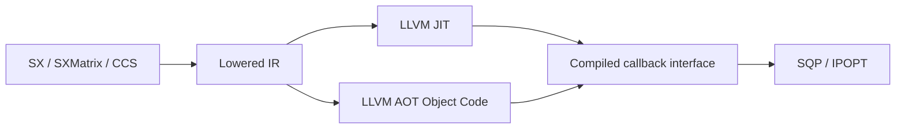

# Architecture

## High-level flow

## Core principles

- symbolic differentiation lives on `SXMatrix`, not `SXFunction`
- execution is compiled, not interpreted
- `CCS` is the concrete sparse storage type today
- solver integration consumes compiled callbacks

## Crates

### `sx_core`

- immutable symbolic scalar nodes
- `SXMatrix` sparse expression matrices in `CCS`
- forward / reverse mode AD
- Hessian strategies

### `sx_codegen`

- backend-neutral lowering
- topological scheduling
- codegen-oriented metadata

### `sx_codegen_llvm`

- LLVM JIT
- LLVM AOT object emission
- generated FFI/context wrappers for AOT integration

### `optimization`

- exact-Hessian SQP using Clarabel subproblems
- IPOPT adapter behind a feature flag
- public symbolic/JIT NLP compile path:
  - `#[derive(optimization::Vectorize)]`
  - `symbolic_nlp(...)`
  - `TypedSymbolicNlp::compile_jit()`
  - `TypedCompiledJitNlp::solve_sqp(...)`
- compiled NLP callback interface with:
  - one design-variable vector
  - zero or more parameter matrices
- typed SQP telemetry callback surface:
  - `solve_nlp_sqp_with_callback`
  - typed iteration snapshots, QP info, line-search info, and termination data

## Symbolic NLP layering

- the public API is the typed scalar-structured layer
- the raw symbolic spec is an internal implementation detail
- runtime variable and nonlinear constraint bounds are applied at solve time
- the same source type also drives numeric flatten/unflatten and generated borrowed views

Current typed layout scope:

- scalar leaves
- fixed arrays
- nested structs
- const-generic container structs

The public layer still avoids a more ambitious reflective schema system; it uses typed `SX` leaves and generated flattening/view helpers instead.

## Testing model

The project intentionally avoids a public interpreter, but tests still use a shared test-only symbolic evaluator as an oracle for:

- low-level AD identities
- CasADi parity adaptors
- JIT-vs-symbolic oracle checks

That evaluator is kept outside the runtime API.
